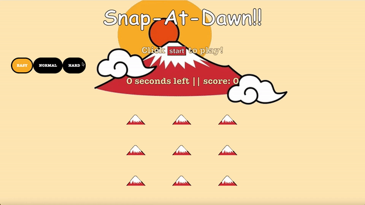

# Snap-At-Dawn!!

A local game development studio has decided to create a new game that's based on Snap-At-Dawn. It's a game in which a player uses a camera to snap mount fuji when the sun rises over it, sun appear at random.

# Installation

1. Fork and clone this repository.
2. Navigate to the project's folder.
3. Run `npm install` to install.
4. To run the unit tests, run `npm test`.

# files structure

|Folder/file path	|Description|
|------|-----|
| `index.html` |	The HTML document that holds the game structure. You will need to modify this file so that the tests pass. |
| `src/styles.css` |	The CSS file that holds the styling of the game. You don't need to modify this file for the tests to pass, but you may want to make optional changes to the file to change the appearance.|
| `src/index.js` | The JS file that holds the functionality of the game. You will need to change this file for the tests to pass. |
| `test/solution.test.js` | This file holds the unit tests of the game.|

## Table of Contents
1. [Introduction](#introduction)
2. [Instructions](#instructions)
3. [Functions](#functions)
4. [Testing](#testing)

## Introduction 
The game consists of moles that randomly appear in holes. Players earn points by clicking on the moles before they disappear. The game includes features like setting difficulty levels and controlling game duration.

## Instructions 
To play the game, open the `index.html` file in a web browser. Click the "Start" button to begin the game. Use the mouse to click on the appearing moles within the time limit to earn points. The game ends when the time runs out.

## Functions 
1. `randomInteger(min, max)`: Generates a random integer within a specified range.

2. `setDelay(difficulty)`: Sets the time delay based on the game difficulty.

3. `chooseHole(holes)`: Chooses a random hole from the list of holes.

4. `gameOver()`: Determines whether the game continues or stops based on the remaining time.

5. `showUp()`: Calls the `showAndHide` function with a specific delay and hole.

6. `showAndHide(hole, delay)`: Shows and hides the mole within a given delay time and hole.

7. `toggleVisibility(hole)`: Adds or removes the 'show' class to a given hole.

8. `updateScore()`: Increments the player's score and updates the scoreboard.

9. `clearScore()`: Resets the player's score to zero.

10. `updateTimer()`: Updates the game timer.

11. `startTimer()`: Starts the game timer.

12. `whack(event)`: Event handler called when a player clicks on a mole.

13. `setEventListeners()`: Adds click event listeners to the moles.

14. `setDifficulty(event)`: Sets the game difficulty based on user selection.

15. `difficultyEventHandler()`: Listens for clicks on the difficulty radio buttons.

16. `disableButtons()`: Disables start and difficulty buttons when the game starts.

17. `enableButtons()`: Enables start and difficulty buttons when the game stops.

18. `setDuration(duration)`: Sets the duration of the game.

19. `stopGame()`: Stops the game and clears the timer.

20. `startGame()`: Starts the game when the 'Start' button is clicked.

